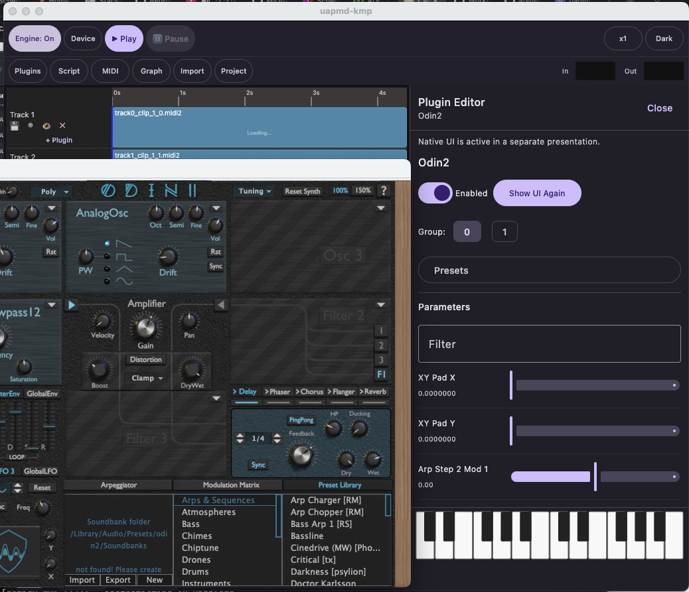

# uapmd-kmp



A Kotlin Multiplatform binding and application for [uapmd](https://github.com/atsushieno/uapmd) — a cross-platform audio plugin host engine supporting VST, AU, CLAP, and AAP (Android Audio Plugin) formats.

The project is split into two parts:

- **`uapmd-binding`** — KMP library that wraps the uapmd C++ engine through platform-native FFI, exposing a common Kotlin API for sequencing, plugin hosting, audio I/O, and parameter control.
- **`composeApp`** — Compose Multiplatform application built on top of the binding layer, providing a sequencer, plugin browser, parameter editor, and spectrum analyzer.

Target platforms: Android, iOS, JVM desktop (macOS, Linux, Windows), and WebAssembly (experimental).

---

## Build instructions

The Gradle project lives under the `kotlin/` subdirectory. All `./gradlew` commands below should be run from there.

### Prerequisites

| Platform | Requirements |
|---|---|
| All | JDK 17 (Temurin recommended) |
| macOS | Xcode command-line tools, `brew install sdl3 ninja` |
| Linux | `gcc-14 ninja-build libgtk-3-dev libwebkit2gtk-4.1-dev libadwaita-1-dev libsdl2-dev` |
| Android | macOS host with Android NDK; publish `aap-core` to Maven Local first (see below) |
| Wasm | Emscripten SDK (installed separately) |

Submodules must be checked out recursively:

```sh
git clone --recursive https://github.com/atsushieno/uapmd-kmp
```

### Android

Publish the AAP framework dependency to Maven Local before the main build:

```sh
cd external/aap-core
./gradlew :androidaudioplugin:publishToMavenLocal
cd ../../kotlin
./gradlew assembleDebug
```

The debug APK is written to `composeApp/build/outputs/apk/debug/`.

### JVM desktop (macOS / Linux / Windows)

```sh
# Run directly
./gradlew :composeApp:run

# Or build a distributable (DMG on macOS, MSI on Windows, deb/rpm on Linux)
./gradlew :composeApp:createDistributable
```

The native shared library (`libuapmd-c-api`) is compiled by CMake as part of the Gradle build and bundled into the JAR via JNE resource paths.

### iOS

Open `iosApp/` in Xcode and run from there, or compile the Kotlin framework directly:

```sh
./gradlew compileKotlinIosArm64            # device
./gradlew compileKotlinIosSimulatorArm64   # simulator
```

### WebAssembly (experimental)

Requires Emscripten activated in the shell environment:

```sh
./gradlew buildUapmdCApiWasm compileKotlinWasmJs
```

The Wasm build is currently disabled in CI while `libremidi` API alignment across platforms is being resolved.

---

## Binding API coverage

The binding layer (`uapmd-binding`) wraps the C API surface defined in `c-api/include/`. The following functional areas are exposed through the common Kotlin API:

| Area | Kotlin type(s) | Description |
|---|---|---|
| Plugin scanning | `UapmdTooling` | Scan plugin directories, enumerate installed plugins and formats, manage the scan cache |
| Plugin instancing | `UapmdPlugin`, `UapmdFactory` | Load and unload plugin instances by plugin ID |
| Plugin instance | `UapmdFunctionBlock` | Start/stop processing, bypass, latency and tail-length queries |
| Parameters | `UapmdFunctionBlock` | Enumerate parameters, get/set values (including per-note controllers), format values as strings |
| Presets | `UapmdFunctionBlock` | Enumerate presets, load by index |
| State | `UapmdFunctionBlock` | Save and restore plugin state (synchronous and callback-based variants) |
| UI presentation | `UapmdFunctionBlock` | Query UI capabilities, create/show/hide/resize embedded plugin windows |
| Sequencer engine | `UapmdEngine` | Create the sequencer, enqueue UMP events with timestamps |
| Timeline | `UapmdTimeline` | Track and event management for sequencer playback |
| Audio / MIDI I/O | `UapmdEngine` | Enumerate audio and MIDI devices, configure the device I/O dispatcher |

The raw C types and opaque handle wrappers are in `UapmdTypes.kt`; platform-specific factory implementations are selected at compile time via `expect`/`actual`.

---

## Architecture and platform bindings

### Common C API layer

All platform bindings share a single C API wrapper (`c-api/`) that presents the uapmd C++ engine as a plain C interface. This keeps the FFI boundary simple and avoids C++ ABI issues across compilers. On mobile and Wasm the library is linked statically; on JVM desktop it is built as a shared library (`.dylib`/`.so`/`.dll`) and discovered at runtime.

### Android — JNI

On Android the C API is compiled with the NDK into `libuapmd-jni.so`, which is loaded at runtime via `System.loadLibrary`. A hand-written JNI layer in `uapmd-binding/src/androidMain/cpp/uapmd_jni.cpp` bridges between Java/Kotlin types and C structs, and `JniBridge.kt` exposes the `external fun` declarations consumed by the rest of the binding. Audio I/O is backed by Oboe.

### JVM desktop — JNA + JNE

The shared library is loaded via [JNA](https://github.com/java-native-access/jna) through a thin interface in `JnaLibrary.kt`. The library binary is embedded in the JAR under `jne/` resource paths (per OS and architecture) and extracted at runtime by the [JNE](https://github.com/psambit9791/jne) loader, so no manual `LD_LIBRARY_PATH` setup is needed on end-user machines. JNA Structure types mirror the C structs; callback interfaces cover C function pointers.

### iOS — Kotlin/Native cinterop

The binding compiles a Kotlin/Native cinterop definition (`cinterop/uapmd.def`) that imports the public C headers directly. Kotlin/Native generates idiomatic Kotlin wrappers at compile time, and the uapmd C API is statically linked into the iOS framework — no shared library deployment is required. `NativeFactory.kt` contains the `actual` implementations that call the generated interop functions.

### WebAssembly — Emscripten

The C API is cross-compiled by Emscripten (`emcmake cmake`) to produce `uapmd-c-api.js` and `uapmd-c-api.wasm`. `WasmJsBridge.kt` declares the Emscripten runtime as an `external interface` (`JsAny`) and calls exported Wasm symbols (prefixed `_uapmd_*`) directly. String marshalling uses Emscripten's UTF-8 helpers, and raw memory management goes through `malloc`/`free` exposed by the Wasm module.

---

## composeApp

`composeApp` is the end-user application. It targets Android, iOS, JVM desktop, and WebAssembly from a single shared Compose codebase under `commonMain`, with small platform-specific entry points (`MainActivity`, `MainViewController`, `main.kt`).

### UI structure

The root composable is `App()`, which resolves the active theme (forced dark) and mounts `MainWindow`. `MainWindow` owns the top-level layout — a collapsible sidebar with a plugin list and track list on the left, and a central pane that can host the timeline editor, node graph, MIDI dump, spectrum analyzer, audio import, or plugin parameter editor depending on the current selection.

State is centralised in `UapmdModel`, which holds the sequencer state and drives a ~60 fps polling loop via `LaunchedEffect` + a coroutine that queries the native engine for audio level and spectrum data. UI events flow from Compose into `UapmdModel`, which calls into `uapmd-binding` and ultimately into the C++ engine.

### Key panels

- **Plugin list** (`PluginList.kt`) — browsable catalog of installed plugins, populated by the scan tool. Plugins can be dragged into the track list.
- **Track list / sequencer** (`TrackList.kt`) — per-track controls, plugin slot assignments, arm/mute/solo.
- **Timeline editor** (`timeline/`) — piano-roll–style MIDI event editor with zoom and scroll.
- **Node graph** (`nodegraph/`) — visual audio routing editor for connecting plugin instances.
- **Parameter editor** (`InstanceDetails.kt`, `InstanceDetailsPanel.kt`) — real-time parameter sliders, preset selector, state save/restore.
- **Spectrum analyzer** (`SpectrumAnalyzer.kt`) — FFT magnitude display updated from the polling loop.
- **Audio import / export** (`AudioImportWindow.kt`, `ExporterWindow.kt`) — file-based audio I/O workflows.

### Platform-specific concerns

File picking uses a `DocumentPicker` `expect`/`actual` to invoke the native file chooser on each platform. Coroutine dispatchers are similarly abstracted through `PlatformDispatchers`. Plugin UI embedding (`PluginUiHosting.kt`) is available on platforms where the C API reports UI support; on others it degrades gracefully.
